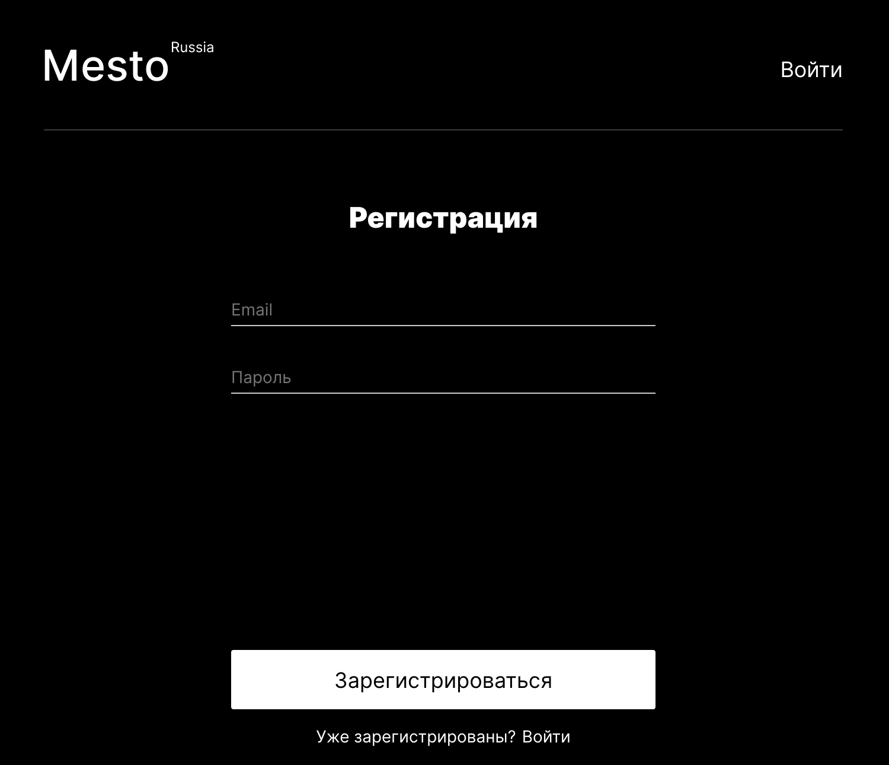
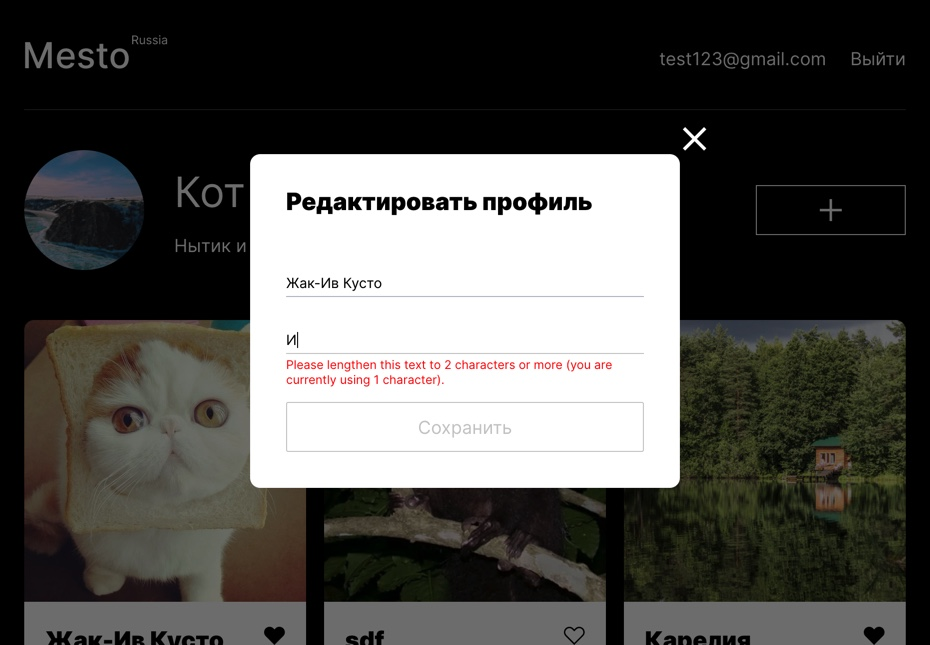

# Mesto
**Mesto на React с авторизацией и регистрацией**. Опубликованный проект можно посмотреть **[здесь](https://yuliaiv-iv.github.io/react-mesto-auth)**

### Описание

Интерактивный сервис с элементами соц сети. Можно опубликовывать и удалять созданные карточки. Реализация постановки и снятие лайка, просмотр фотографий в увеличенном формате. Возможность обновлять инфо и аватар юзера. Реализована регистрация и авторизации пользователя, переадресация, защита маршрутов

### Технологии

* **`React`**
* **`React router dom`**
* **`HTML5, CSS3`**
* **`Адаптивная верстка`** с использованием **`медиа-запросов`**
* **`Flex`** и **`Grid-layout`**
* Live **`валидация форм`**
* **`Local storage и JWT`** 
* **`Регистрация и авторизация`**
* **`API для аутентификации пользователей`**

### Методологии
* ООП
* БЭМ

### Запуск и установка
* `npm install` установка модулей, перечисленных как зависимости в package.json
* `npm start` запустить проект для просмотра в браузере

### Figma 
**[Ссылка](https://www.figma.com/file/fUESH7icdnexdbpwgYsUcc/Sprint-14-(RU)?node-id=0%3A1)** на макет в Figma

    
    

